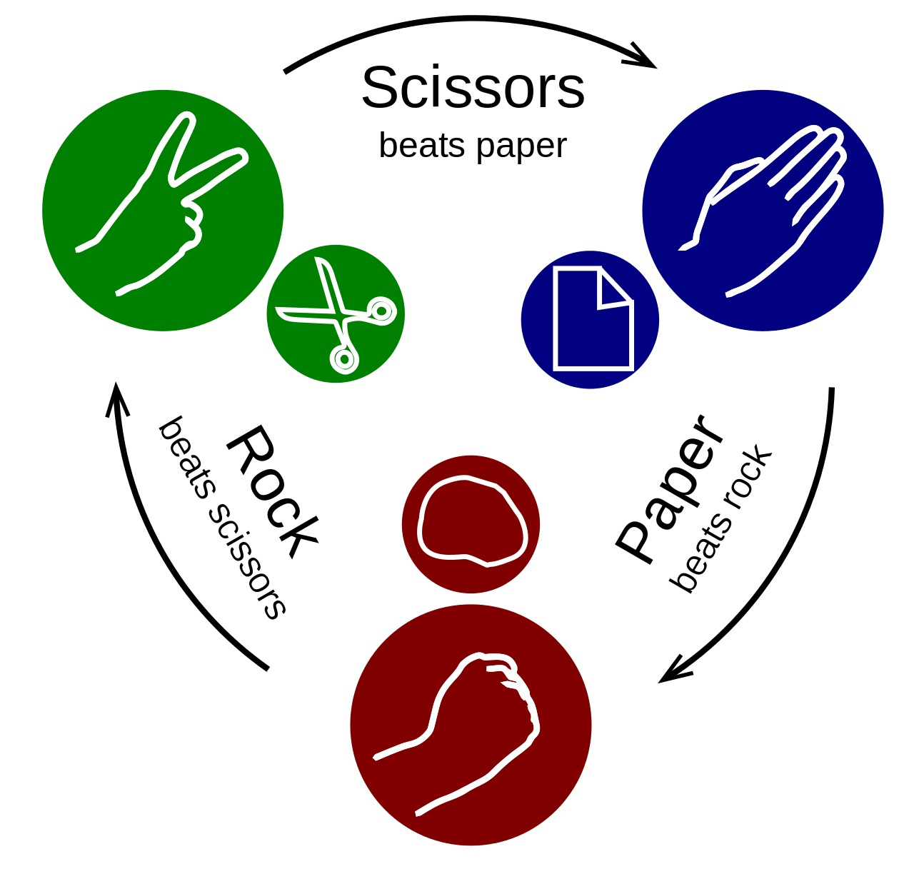
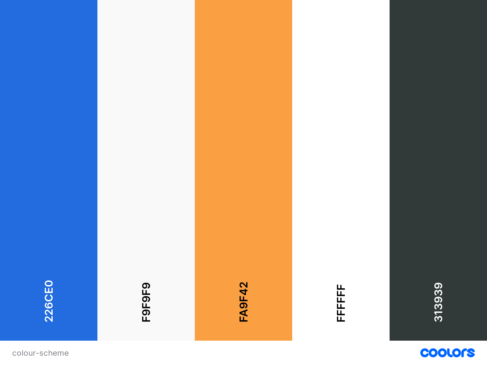
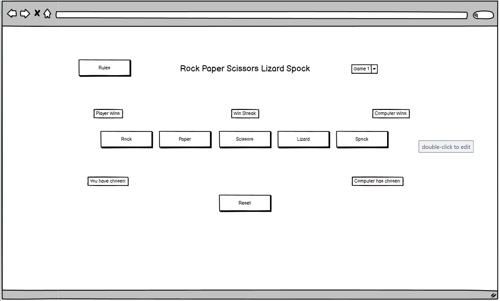
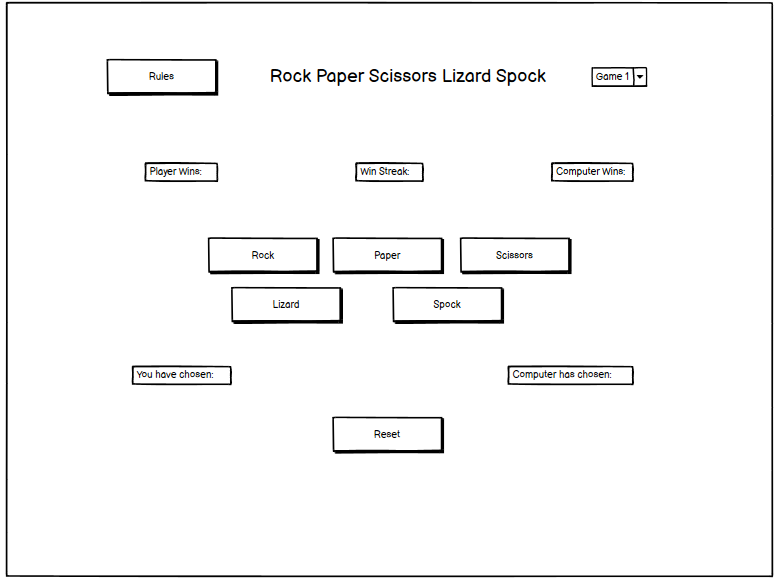
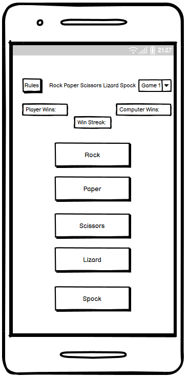
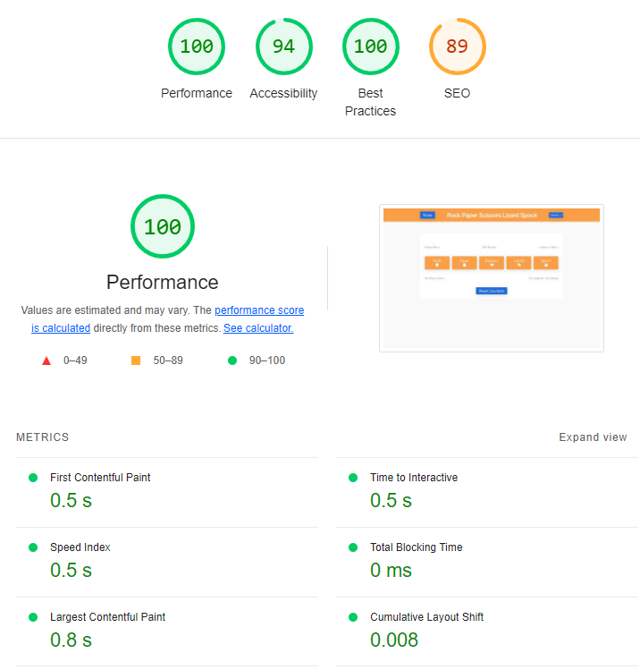

# Rock Paper Scissors Lizard Spock
Rock Paper Scissors Lizard Spock is a more advanced version of the classic hand game Rock Paper Scissors. The popularity of this version of the game emerged in 2008 after the airing of The Big Bang Theory episode that introduced the game originally created by Sam Kass and Karen Bryla http://www.samkass.com/theories/RPSSL.html. Many online versions of the game began to appear since then to entertain fans across the world wide web.

This version of the game aided the developer in understanding and implementing the fundamentals of Java Script whilst also keeping user experience in mind.

## Existing Features:

### The Header Section
This area contains the title of the game in the centre so users know exactly what game they are playing. A rules button to the left, once clicked, reveals an image depiction of the rules of the game for players to understand. written description for vision impaired users.
A dropdown button to the right, once clicked, gives the user the option of playing either the advanced Rock Paper Scissors Lizard Spock or the classic Rock Paper Scissors game against the computer, with the title changing depending on the game chosen.

### Game Area
This area contains several components.
The top of the area contains a score-tracker so the user can keep track of how many times they have won or lost as well as streak-counter to show how many games in a row have been won. 

The centre of the area contains the button options for the game itself. The buttons have text and icon depictions of the options for optimum user experience. 
Once an option has been selected, the site displays what the user and the computer have chosen. At the same time, it will show whether the result is a win, lose or draw. Underneath the prompt, it will display why the user won or lost with phrases such as “Rock beats Paper” etc. This aids in the user’s understanding of the game by explaining why they won/lost.

The bottom of the area contains a Reset Counters button that, when clicked, will reset the score-tracker back to zero. This is an added function for users to challenge themselves to obtain higher win streaks or to simply start afresh. 

### Potential Features to Add

A multiplayer option to play the game against friends rather than just the computer. 

## Design

### Website Comparisons

The following websites with the same gameplay as this site were examined for layout, code and content ideas:
- https://veerasundar.com/rock-paper-scissor-lizard-spoc/
- https://serialized.net/app/rpsls/
- https://rpsls.net/#1saat

### Images
The image depicting the rules of the games were taken from [openclipart.org](https://openclipart.org/detail/325665/rock-paper-scissors-lizard-spock) and [wikipedia.org](https://en.wikipedia.org/wiki/Rock_paper_scissors). The images help to give visual representation of the rules of the game to the user.
 

### Fonts

Fonts were chosen using [Google Fonts](https://fonts.google.com/)

Raleway was chosen as the main font, with helvetica and sans-serif set as the alternatives. Raleway was used on the love-maths project which the developer thought was visually pleasing and would suit the game being developed.

### Colour Scheme

- Colour scheme was selected using [Coolors](https://coolors.co/)

- Red and green were also used sparingly to better depict a win or lose situation for the user. If you win, the reason why is displayed in green text whereas if you lose, the reason why displays in red.

### Wireframes

- 

- 

- 

## Testing

### Validator Testing
1. HTML
- HTML was tested with [W3C Markup Validation Service](https://validator.w3.org/)
- Initial testing showed some typescript errors that were easily corrected.
- Initial testing also warned of empty h2 and h3 headings. These were filled in with prompts to avoid this issue.
- 0 errors returned once warnings were fixed.

2. CSS
- CSS was tested with [W3C CSS Validation Service](https://jigsaw.w3.org/css-validator/)
- 0 errors returned.

3. JAVASCRIPT
- JS was tested with [JS Hint](https://jshint.com/)
- Metrics:There are 14 functions in this file.
- Function with the largest signature take 3 arguments, while the median is 1.
- Largest function has 19 statements in it, while the median is 2.5.
- The most complex function has a cyclomatic complexity value of 3 while the median is 1.
- One Warning Returned:
"Functions declared within loops referencing an outer scoped variable may lead to confusing semantics. (startGame)." This warning was noted. The developer added comments to the function to prevent confusing semantics.

4. LIGHTHOUSE

## Browser Display
The completed site displays correctly on Google Chrome, Microsoft Edge and Safari browsers.
Screen Sizes
The completed site displays correctly on a variety of screen sizes, including desktop, tablet, iphone and Samsung phones.
Desktop Display SCREENSHOT
Tablet Display SCREENSHOT
Mobile Display SCREENSHOT

## Technologies Used

### Languages Used
- HTML5
- CSS3
- JavaScript

### Frameworks, Libraries & Programs Used
1. Balsamiq
- Used to create wireframes for the site prior to coding.
2. Google Fonts
- Used to import selected fonts into style.css file.
3. Font Awesome
- Used to add icons to buttons.
4. Coolers
- Used to select a simplistic, pleasing colour pallet.
5. Git
- Used for version control.
6. Github
- Used to store the site's code once pushed from Git.
7. ImageOptim
- Used to compress the sites images to improve page speed.

## Deployment
The site was deployed to GitHub pages as follows:
Select settings in Github repository.
Select pages from the sidebar.
From the drop-down menu below the Source heading, select 'Deploy from a branch'.
From the drop-down menu below the Branch heading, select main branch. Then select root from the folder drop-down menu.
Select Save.
The page will then show a ribbon display to indicate the successful deployment.
The live link can be found here - INSERT LIVE LINK HERE

## Credits

### Content
All text content and rules for the game were sourced from WIKIPEDIA LINK.
The steps in the Deployment section of this README.md file was sourced from the Code Institute Sample ReadMe

### Media
All images used were from Unsplash
All icons used were from Font Awesome
Colour scheme was selected using Coolors
Flexbox Froggy was used to learn and impliment flex styling in the style.css file.

## Programming Solutions

## Acknowledgements
My fellow classmates for collaborative problem-solving with JavaScript.

